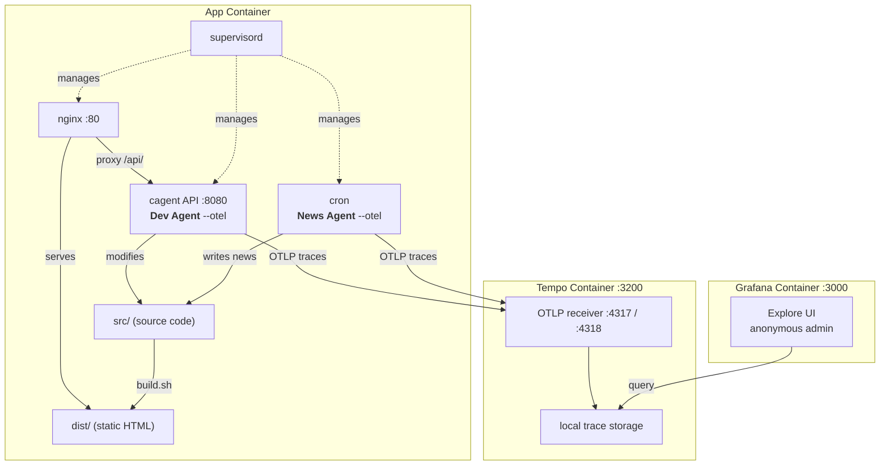
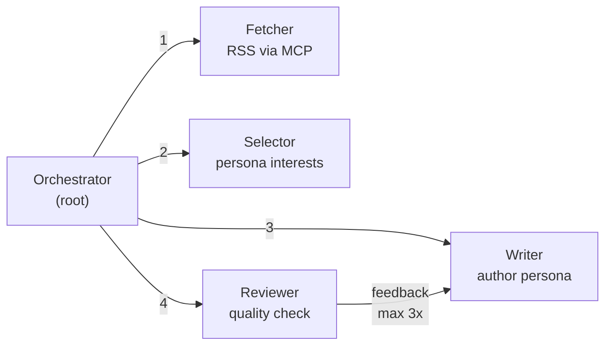
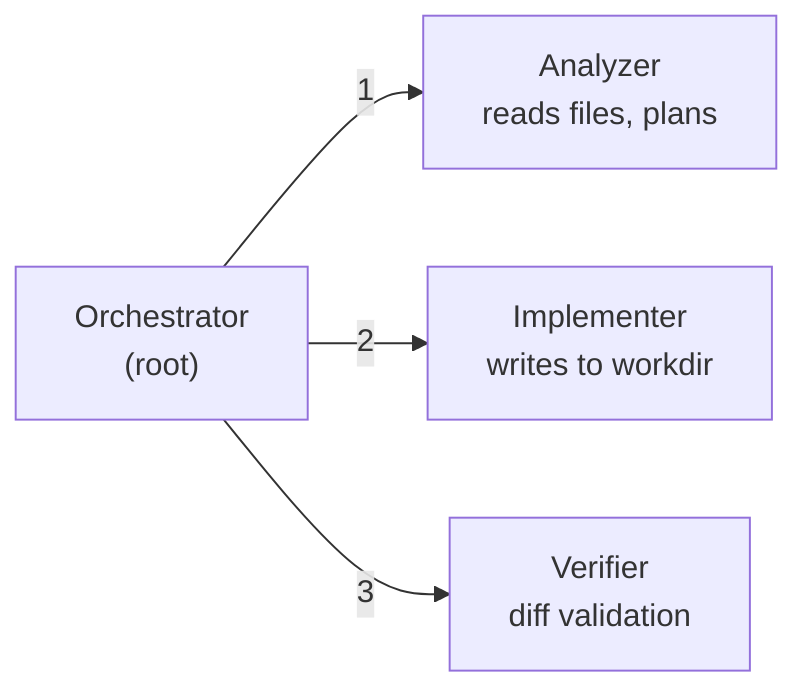

# SelfProgramingDockerAgent

A self-modifying news website in Docker containers. AI agents (powered by [Docker Agent](https://docs.docker.com/ai/docker-agent/) + Azure OpenAI) run inside the app container with full OpenTelemetry tracing to Grafana.

- **News Agent** — multi-agent pipeline: fetches 31+ RSS feeds, selects the best story, writes expert analysis, reviews quality, publishes
- **Dev Agent** — multi-agent pipeline: analyzes admin instructions, implements frontend changes on a **git feature branch** (via worktree), verifies results, merges on deploy

No restart needed — agents edit source, rebuild, and changes appear instantly. Optionally connects to a remote git repo (supports private repos via SSH key or HTTPS token).

## Quick Start

### 1. Clone & configure

```bash
git clone <repo-url> && cd SelfProgramingDockerAgent
```

Create `.env` (or edit the existing one):

```env
AZURE_API_KEY=your-azure-api-key
AZURE_OPENAI_ENDPOINT=https://your-resource.services.ai.azure.com
AZURE_RESOURCE_NAME=your-resource
ADMIN_PASSWORD=admin
RSS_INTERVAL_MINUTES=60
NEWS_AUTHOR_PERSONA=Cloud Solutions Architect specializing in Azure, AWS, AI/ML, and .NET development
NEWS_SELECTOR_PERSONA=Prioritize: cloud architecture, AI/ML innovations, DevOps practices, security, .NET ecosystem, Kubernetes
```

### 2. Run

```bash
docker compose up --build
```

### 3. Use

| URL | What |
|---|---|
| `http://localhost:8080` | News site |
| `http://localhost:8080/admin.html` | Admin chat (login: `admin` / your `ADMIN_PASSWORD`) |
| `http://localhost:3000` | Grafana — trace explorer (no login required) |

The news agent will automatically start fetching and publishing after `RSS_INTERVAL_MINUTES`.

## Environment Variables

| Variable | Required | Description |
|---|---|---|
| `AZURE_API_KEY` | Yes | Azure OpenAI API key |
| `AZURE_OPENAI_ENDPOINT` | Yes | Azure OpenAI endpoint URL |
| `AZURE_RESOURCE_NAME` | Yes | Azure resource name |
| `ADMIN_PASSWORD` | No | Admin panel password (default: `admin`) |
| `RSS_INTERVAL_MINUTES` | No | News fetch interval in minutes (default: `60`) |
| `NEWS_AUTHOR_PERSONA` | No | Writing perspective for news articles (default: `Cloud Solutions Architect and AI Evangelist`) |
| `NEWS_SELECTOR_PERSONA` | No | Interest filter for news prioritization (default: `cloud architecture, AI/ML, DevOps, security`) |
| `GIT_REPO_URL` | No | Git repo to clone on startup (default: local init) |
| `GIT_BRANCH` | No | Base branch name (default: `main`) |
| `GIT_TOKEN` | No | HTTPS token for private repos (GitHub PAT, GitLab token, etc.) |
| `GIT_SSH_KEY` | No | Raw SSH private key content for private repos |
| `GIT_SSH_KEY_PATH` | No | Path to mounted SSH key file |
| `GIT_USER_NAME` | No | Git commit author name (default: `Tech Pulse Agent`) |
| `GIT_USER_EMAIL` | No | Git commit author email (default: `agent@techpulse.local`) |
| `OTEL_EXPORTER_OTLP_ENDPOINT` | No | OpenTelemetry collector endpoint (default: `http://tempo:4317`) |
| `OTEL_SERVICE_NAME` | No | Service name for traces (default: `tech-pulse-agent`) |

## Architecture



## News Agent — Multi-Agent Pipeline

The news agent (`agents/news-agent.yaml`) is a 5-agent pipeline:



- **Orchestrator** reads `NEWS_SELECTOR_PERSONA` and `NEWS_AUTHOR_PERSONA` from env, deduplicates by URL, coordinates the pipeline, validates and publishes
- **Selector** prioritizes articles based on `NEWS_SELECTOR_PERSONA`
- **Writer** creates content from `NEWS_AUTHOR_PERSONA` perspective
- **Reviewer** checks for: excessive bold/caps, filler phrases, formatting issues, length constraints — returns APPROVED or actionable feedback
- Each agent has its own model definition for independent model swapping

## Dev Agent — Multi-Agent Pipeline

The dev agent (`agents/dev-agent.yaml`) is a 4-agent pipeline:



Accessible through the admin chat UI at `/admin.html` (Basic Auth protected).

### Git Workflow

The dev agent uses **git worktrees** for safe, isolated changes:

1. Each task creates a **feature branch** (`feature/{session-id}`) and a worktree at `/app/workdir`
2. Changes are made in the worktree, isolated from the main branch
3. On **deploy**: feature branch is merged to main, worktree cleaned up, site rebuilt
4. On **discard**: worktree removed, feature branch deleted — no traces left

**Remote repo support** (optional): set `GIT_REPO_URL` to clone a remote repo on startup. For private repos, use one of:
- `GIT_TOKEN` — HTTPS personal access token (GitHub, GitLab, Azure DevOps)
- `GIT_SSH_KEY` — raw SSH private key as env var
- `GIT_SSH_KEY_PATH` — path to a mounted SSH key file

## Observability

Both agents export OpenTelemetry traces via the `--otel` flag. Traces flow to Grafana Tempo and are visualized in Grafana.

**What's in the traces:**
- Agent sessions and sub-agent delegations (transfer_task)
- Tool calls with execution timing
- Token usage per model (input/output tokens)
- Errors and session metadata

**How to view traces:**
1. Open Grafana at `http://localhost:3000`
2. Go to Explore (compass icon in sidebar)
3. Select "Tempo" datasource
4. Search by service name `tech-pulse-agent` or browse recent traces

Each news agent run produces a trace showing the full pipeline: orchestrator → fetcher → selector → writer → reviewer (with revision loops visible as repeated spans).

**Note:** Message content (prompts/responses) is NOT included in traces for privacy. For full conversation logs, check `/var/log/news-agent.log` inside the container:
```bash
docker compose exec app cat /var/log/news-agent.log
```

## Admin Chat Examples

In the admin panel (`/admin.html`) you can tell the Dev Agent things like:

- "Change the site title to Daily Digest"
- "Add a dark mode toggle"
- "Make news cards show the date in a more readable format"
- "Add a footer link to our GitHub repo"

The agent will analyze, implement, verify, and report the changes.

## RSS Feeds

Configured in `src/config/feeds.json` — currently 31+ feeds covering:

- **Tech news**: Hacker News, TechCrunch, The Verge, InfoQ, The New Stack
- **.NET ecosystem**: Microsoft .NET Blog, Visual Studio, NuGet, JetBrains, Andrew Lock, Scott Hanselman, Nick Chapsas
- **Cloud**: Azure, AWS, Google Cloud
- **Cloud-native**: Kubernetes, CNCF, Dapr, HashiCorp, Grafana
- **Polish tech**: Niebezpiecznik, Antyweb
- **Architecture**: Martin Fowler, AWS/Azure Architecture Blogs

To add/remove feeds, edit `src/config/feeds.json`.
